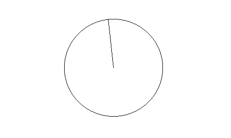

# Лабораторная работа №1

Алгоритм Брезенхема для прямой и окружности.

# Выполнение лабораторной работы

Функции, отрисовывающие окружность и отрезок, реализованы в файле [bresenham.cpp](src/bresenham.cpp).

Сами сигнатуры (вместе с документацией) находятся в [bresenham.hpp](include/bresenham.hpp).

Результат работы программы приведён ниже.

