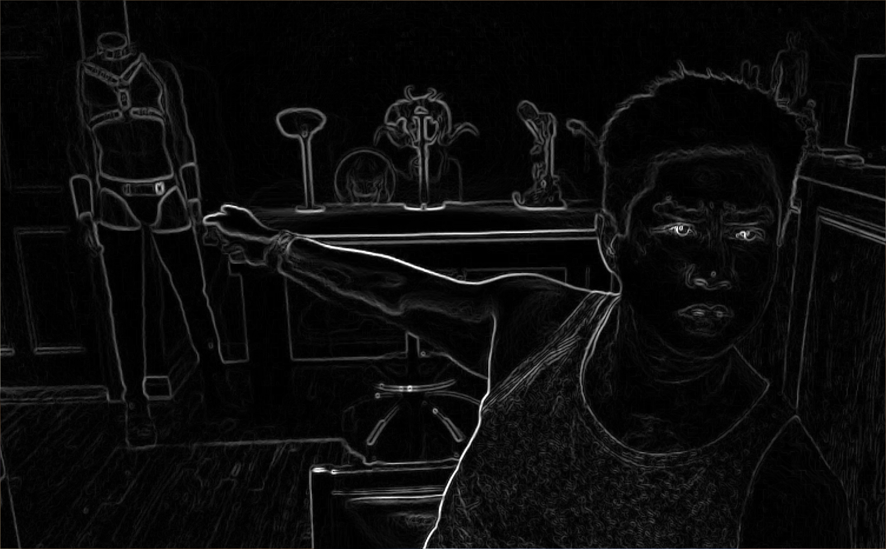

# Лабораторная работа №3

Фильтр Собеля

# Выполнение лабораторной работы

Программа запускается следующим образом:

```bash
$ ./lab03 <image>
```

После этого программа показывает отфильтрованное изображение.

Пример работы приведён ниже.

Оригинал:


Результат:


