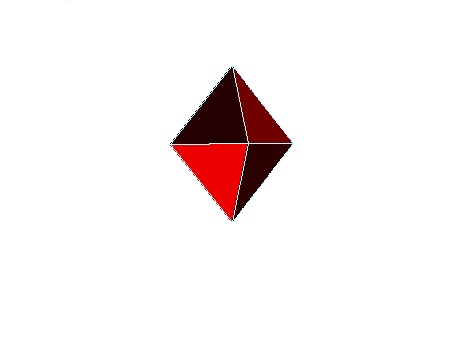

# Лабораторная работа №7

Построение 3D фигуры с освещением.

# Выполнение лабораторной работы

Функции для построения 3D фигуры (вместе с вспомогательными функциями) описаны в заголовочном файле [render.hpp](include/render.hpp) и реализованы в [render.cpp](src/render.cpp).

Ниже представлен пример работы программы.

